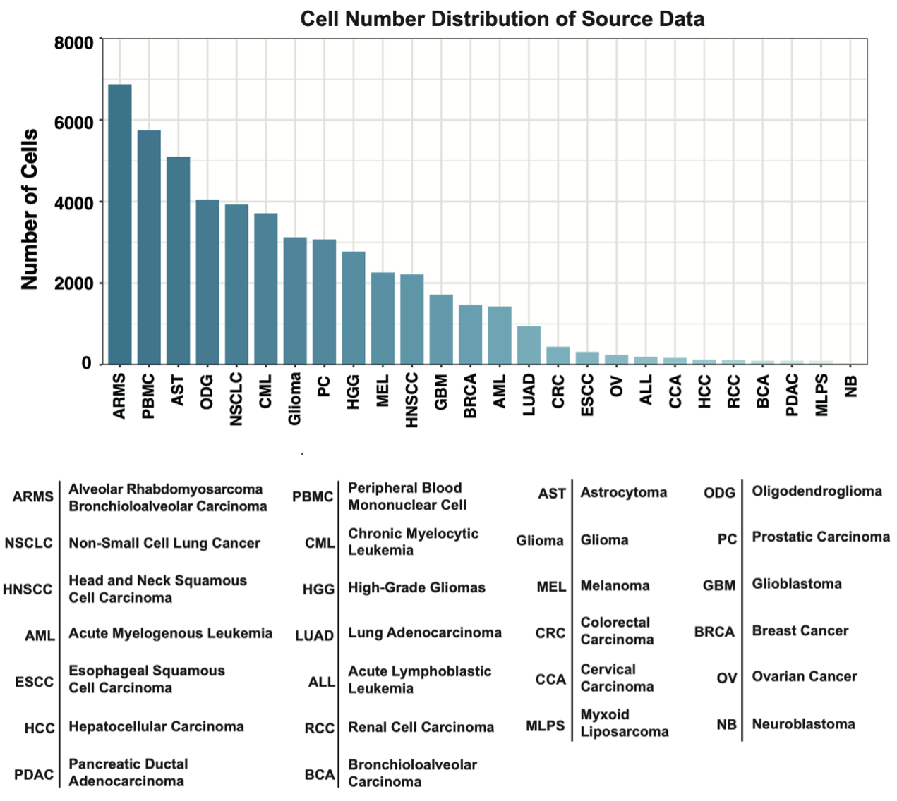

## Code for **Deep transfer learning enables lesion tracing of circulating tumor cells (CTC-Tracer)**
## Introduction
Liquid biopsy offers great promise for noninvasive cancer diagnostics, while the lack of adequate target characterization and analysis hinders its wide application. Single-cell RNA sequencing (scRNA-seq) is a powerful technology for cell characterization. Integrating scRNA-seq into a CTC-focused liquid biopsy study can perhaps classify CTCs by their original lesions. However, the lack of CTC scRNA-seq data accumulation and prior knowledge hinders further development. Therefore, we design CTC-Tracer, a transfer learning-based algorithm, to correct the distributional shift between primary cancer cells and CTCs to transfer lesion labels from the primary cancer cell atlas to CTCs. The robustness and accuracy of CTC-Tracer are validated by 8 individual standard datasets. We apply CTC-Tracer on a complex dataset consisting of RNA-seq profiles of single CTCs, CTC clusters froma BRCA patient, and two xenografts, and demonstrate that CTC-Tracer has potential in knowledge transfer between different types of RNA-seq data of lesions and CTCs.

## Datasets
### Datasets used in source domains:
1. sparse_50318_for_26types.npz (primary tumors with 26 cell types, can be searched and downloaded from `http://117.25.169.110:1032/`)`simply click the search button, and the file will be displayed. :)`;
### Datasets used in target domains:
1. data_examples/CTC_pub_train_372_exp.txt (CTCs with four cell types);
2. data_examples/nature_306_brca_logtpm.csv (Complex CTCs with one cell type);
3. data_examples/PBMC_logtpm_400cells.csv (400 PBMC cells);
### Cell types involved in source domains

> Note that, in the second transfer learning task (shown below), the PBMC served as an individual class, and the other 25 types served as an unique class.
## Transfer learning tasks
1. Primary Tumors (26 types) -> CTCs (4 types)
 > source (sparse_50318_for_26types.npz) | target (data_examples/CTC_pub_train_372_exp.txt)
2. Primary Tumors with blood cells (2 types) -> CTCs with blood cells (2 types)
 > source (sparse_50318_for_26types.npz) | target (data_examples/CTC_pub_train_372_exp.txt (Cell type:CTC) +PBMC_datasets (Cell type:PBMC)) | Note that: PBMC as one class and the other types as another class.
3. Primary Tumors (26 types) -> complex CTCs (1 types) (using the pre-trained model from the first Transfer task)
 > source (sparse_50318_for_26types.npz) | target
 (data_examples/nature_306_brca_logtpm.csv) \

> Note that, different types represent different classes.
## Prerequisites

To install requirements:

```setup
pip install -r requirements.txt
```

- Python 3.8.0
- GPU Memory: 3GB+
- Pytorch 1.11.0
- Any Computer with a GPU

## Demo
- simple demos can be found in **./Demo.ipynb**
- if you want to reproduce training process, you need to download the source dataset used in this study(sparse_50318_for_26types.npz) from the website(`http://117.25.169.110:1032/`)`simply click the search button, and the file will be displayed. :)`.

## Data preprocessing
we supply scripts for preprocessing of the raw data. 


input tabular data structure: 
```
      Barcode1 Barcode2 Barcode3 Barcode4 Barcode5
Gene1 ...
Gene2          ...     
Gene3                   ...
Gene4                            ...
Gene5                                     ...
```
> Gene symbol or ensemble ID is supported

Run data preprocess scripts(special file path and gene ID):
```
Rscript ./utils/preprocess.R -i <file path>
```
and
```
python ./utils/preprocess.py --file <outputs from R> --save_path <path to save>
```
final outputs are the logTPM gene expression csv files.
## Training
**Train model** (transductive prediction model)
> fill the paramters in ./config/ctc_net.yaml and run 
```
python ctc_transductive_training.py
```
- model training step
- train log file/model checkpoint can be found in ./snapshot/<'PATH'>

## Evalution 
inductive prediction
> fill the paramters in ./config/val.yaml and run
```
python ctc_inductive_training.py
```
- return tabular prediction file at result file path(./results/<'PATH'>).

## Fine-tune
Fill the `init_weight` parameter in `config/ctc-net.yaml` and then fill the new data path. Then run `python ctc_transductive_training.py`. And a fine-tune training step starts.
## Visualization
Fill the parameters in `config/vis.yaml` and just run `python Visualization.py`. You can get a low-dimension embedding of the pretrained model.
## Gene Marker Finder
> Custom scripts for searching gene markers based on scanpy(1.9.1), see in ./utils/gene_finder{}.py
## License
This project is licensed under the MIT license.
- - -
## Citation
If you are using this code for your own researching, please consider citing
```
@article{guo2022deep,
  title={Deep transfer learning enables lesion tracing of circulating tumor cells},
  author={Guo, Xiaoxu and Lin, Fanghe and Yi, Chuanyou and Song, Juan and Sun, Di and Lin, Li and Zhong, Zhixing and Wu, Zhaorun and Wang, Xiaoyu and Zhang, Yingkun and Li, Jin and Zhang, Huimin and Liu, Feng and Yang, Chaoyong and Song, Jia},
  journal={Nature Communications},
  volume={13},
  number={1},
  pages={1--14},
  year={2022},
  publisher={Nature Publishing Group}
}
```
